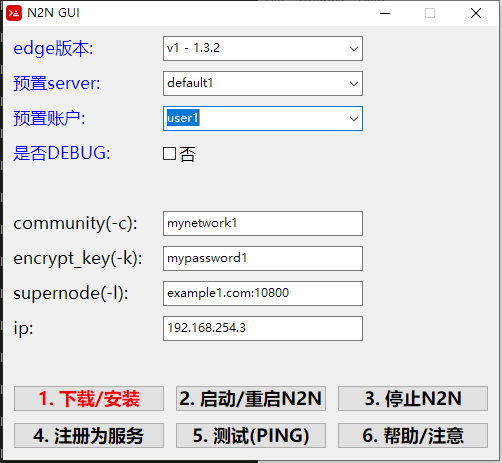

# N2N

用`red`语言写的一个`edge`GUI

界面如下:



## 编译
```
red.exe -r -t Windows n2n.red
```

从远程下载n2n.red,然后运行
```
red.exe -r -t Windows n2n_remote.red
```

## 配置

文件名: config.red

和`n2n.exe`放到同一个目录

```red
Red []

;; 配置文件
users: [
    ; 用户和分配的IP
    ["user1" "192.168.254.3" ]
    ["user2" "192.168.254.2" ]
]
 
users_index_name: 1
users_index_ip: 2

servers: [
    ["default1" "example1.com:10800" "mynetwork1" "mypassword1"]
    ["default2" "example2.com:10800" "mynetwork2" "mypassword2"]
]

servers_index_name: 1
servers_index_supernode: 2
servers_index_community: 3
servers_index_encrypt_key: 4
```
